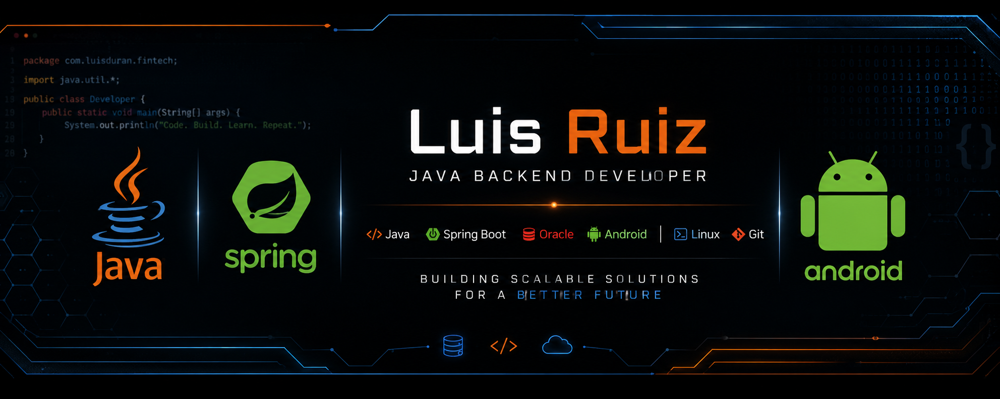

<!-- ===================== BANNER ===================== -->

  

<!-- ===================== TYPING ===================== -->

<h1 align="center">
Hola 👋 Soy Luis Ruiz
</h1>

<h3 align="center">
☕ Java Backend • 📱 Android • 🏦 Fintech
</h3>

Apasionado por el desarrollo Backend utilizando Java, Spring Boot y Oracle Database.

---

# 👨‍💻 Sobre mí

- ☕ Especializándome en Java Backend
- 🌱 Aprendiendo Spring Boot y Arquitectura Limpia
- 📱 Desarrollo Android con Kotlin
- 🏦 Construyendo proyectos Fintech
- 🐳 Aprendiendo Docker y Linux
- 🚀 Buscando mejorar cada día como desarrollador

---

# 🛠 Stack Tecnológico

---

# 📊 Actividad

---

# 🚀 Proyectos

| Proyecto | Tecnologías |
|----------|-------------|
| 🏦 Fintech API | Java · Spring Boot · Oracle |
| 📱 Android POS | Kotlin · Room |
| 🌐 Jaguar Wheels | HTML · CSS · Bootstrap |
| ⚙️ REST API | Spring Boot |

---

# 🎯 Objetivos 2026

✅ Oracle Java Certification

✅ Spring Boot

✅ Docker

✅ Android

✅ Oracle Database

✅ Proyecto Fintech completo

---

# 📫 Contacto

  
  &nbsp;&nbsp;&nbsp;
  

⭐ Gracias por visitar mi perfil ⭐

